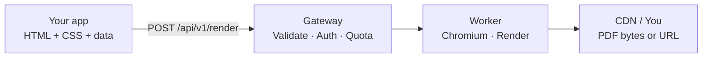

Rendio converts HTML to PDF (or PNG/JPEG) using a pool of headless Chromium
browsers. This page walks through the pipeline — useful when you're
debugging a render, choosing between URL and buffer modes, or picking the
right `waitUntil` value.

## The pipeline



### 1 — Your request hits the gateway

`POST /api/v1/render` is received by the gateway. In this single step it:

- Parses and validates the body against the Zod schema (fails fast with
  `validation_error` / `html_too_large`).
- Authenticates the bearer token (`invalid_api_key` on failure).
- Checks your plan quota and rate limits
  (`quota_exceeded`, `rate_limit_exceeded`, `concurrent_limit_exceeded`).
- Applies feature gates (`plan_limit` for `url_to_pdf`,
  `custom_js_execution`, `tagged_pdf`, `external_resources`).
- If `Idempotency-Key` is present and this key + body hash have been seen in
  the last 24h, serves the cached response without reaching the worker.
- Otherwise forwards a worker-shaped payload to the render pool.

### 2 — The worker renders

A warm Chromium instance from the pool:

1. Compiles Handlebars templates (when `data` is non-empty).
2. Creates a fresh browser context (no persistent state across renders).
3. Loads HTML + CSS (or navigates to `source` in URL mode).
4. Waits for the page to be ready per `waitUntil` (see below).
5. Optionally runs your `javascript` payload (5s timeout, `customJsExecution` gated).
6. Optionally waits for `waitForSelector` (10s timeout).
7. Generates the PDF or screenshot with the requested layout options.

Simple templates render in under 50&nbsp;ms; business documents like invoices and reports typically complete under 100&nbsp;ms. See [Benchmarks](/resources/benchmarks) for the full range. Server-side
timeout is 30 seconds — beyond that you get `render_timeout`.

### 3 — Output delivery

Two response modes, chosen via `response`:

- **`response: "url"` (default)** — the PDF is uploaded to object storage
  behind `cdn.rendio.dev`. You receive a JSON body with the CDN URL, size,
  page count, and `expiresAt`. The file is retained for the plan's retention
  window.
- **`response: "buffer"`** — raw bytes stream back in the response body.
  No file is stored on Rendio's CDN. No storage quota consumed.

### Public vs. private files

By default, files are **public** — served on a permanent, unsigned CDN URL
that anyone with the link can access. For sensitive documents (invoices,
contracts, medical records), use **private** storage:

```json
{
  "html": "<h1>Confidential Report</h1>",
  "storage": {
    "visibility": "private",
    "signedUrlTtl": 300
  }
}
```

Private files are stored in a separate bucket and served via **HMAC-signed
URLs** that expire after `signedUrlTtl` seconds (default: 1 hour, max: 7
days). The response includes both timestamps:

- `expiresAt` — when the **file** is deleted from storage (plan retention: 24h Free, 30d Starter/Pro).
- `urlExpiresAt` — when the **signed URL** expires. After this, the URL returns 410 Gone.

To generate a fresh signed URL for an existing file, call
`GET /api/v1/files/{id}?ttl=300`. This does not re-render — it returns
a new signed URL for the same file. Use this when sharing time-limited
download links or when the previous URL has expired.

<Tabs>
  <Tab title="Node">
    ```ts
    // Render with private storage
    const pdf = await rendio.pdfs.create({
      html: "<h1>Invoice #42</h1>",
      storage: { visibility: "private", signedUrlTtl: 3600 },
    });
    console.log(pdf.url);           // signed URL (1h)
    console.log(pdf.urlExpiresAt);  // "2026-04-21T13:00:00.000Z"

    // Later — refresh the signed URL
    const fresh = await rendio.pdfs.get(pdf.id, { ttl: 300 });
    console.log(fresh.url);         // new signed URL (5min)
    ```
  </Tab>
  <Tab title="Python">
    ```python
    # Render with private storage
    pdf = client.pdfs.create(
        html="<h1>Invoice #42</h1>",
        storage={"visibility": "private", "signed_url_ttl": 3600},
    )
    print(pdf.url)             # signed URL (1h)
    print(pdf.url_expires_at)  # "2026-04-21T13:00:00.000Z"

    # Later — refresh the signed URL
    fresh = client.pdfs.get(pdf.id, ttl=300)
    print(fresh.url)           # new signed URL (5min)
    ```
  </Tab>
  <Tab title="Go">
    ```go
    // Render with private storage
    pdf, _ := client.Pdfs.Create(ctx, rendio.PdfCreateParams{
        HTML: "<h1>Invoice #42</h1>",
        Storage: &rendio.StorageOptions{
            Visibility:   "private",
            SignedURLTTL: rendio.Int(3600),
        },
    })
    fmt.Println(pdf.URL)          // signed URL (1h)
    fmt.Println(*pdf.URLExpiresAt) // "2026-04-21T13:00:00.000Z"

    // Later — refresh the signed URL
    fresh, _ := client.Pdfs.Get(ctx, pdf.ID, &rendio.PdfGetOptions{TTL: rendio.Int(300)})
    fmt.Println(fresh.URL)        // new signed URL (5min)
    ```
  </Tab>
</Tabs>

## `waitUntil` — when is the page "ready"?

The default is `domcontentloaded`, which waits for the DOM tree to be parsed
but not for images, fonts, or other subresources. Choose based on what your
HTML needs:

| Value | Waits for | Use when |
|---|---|---|
| `commit` | Navigation committed | Fully self-contained HTML, no external refs |
| `domcontentloaded` | DOM parsed (default) | HTML with inline CSS, base64 images |
| `load` | All resources loaded | HTML references remote images, fonts, stylesheets |
| `networkidle` | No network for 500ms | SPAs, long-polling, lazy-loaded assets |

Picking a stricter value (`load`, `networkidle`) over a looser one adds
latency but prevents blank images or unstyled text in your output.

## Output formats

| `output` | Content-Type | Notes |
|---|---|---|
| `pdf` (default) | `application/pdf` | Multi-page documents |
| `png` | `image/png` | Full-page screenshot |
| `jpeg` | `image/jpeg` | Full-page screenshot, smaller than PNG |

## Preview mode

`preview: true` adds a development watermark, does not consume the monthly
quota, and is rate-limited to 50 renders/day per user on Free (unlimited
on paid plans). Must use `response: "buffer"`. **An API key is still
required** — there is no keyless API access.

The VSCode extension uses `preview: true` for live preview-as-you-type when
an API key is configured. Without one, the extension falls back to a local
HTML-only webview and does not call the API.

## Isolation and security

- Each render runs in a fresh browser context. No shared state.
- URL mode blocks requests to `localhost`, `127.0.0.1`, and RFC1918 ranges
  (SSRF policy). Hits return `url_blocked`.
- External resources in HTML/CSS are loaded, but with a hard timeout so a
  slow remote font can't wedge your render.
- Your `javascript` runs inside the page with a 5-second execution cap.

<Warning>
  Do not render untrusted user HTML without sanitization. Chromium is
  sandboxed, but malicious HTML can still attempt to fetch external
  resources, inflate render time, or leak data via side channels.
</Warning>
