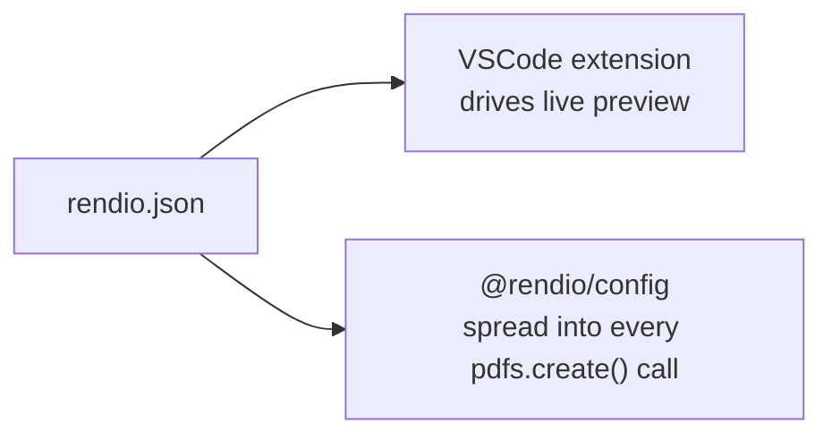

{/* TODO: Add hero screenshot — full VSCode window with:
   Left: HTML/Handlebars template editor
   Right: Rendio preview panel with rendered PDF
   Bottom: status bar with render time
   Save as /images/vscode-dev-prod-parity.png (1600×900, dark theme). */}

## The problem

Every PDF API has the same gap: templates look one way in development,
another in production. Fonts shift. Margins break. Page breaks land on
the wrong line. You ship, QA catches it, you hotfix. You ship again.

The root cause is always the same: the dev tool and the production call
use **different parameters**. Your preview assumed A4; your code sent
Letter. Your preview had no margins; your API call had `20mm`. The
settings lived in two places, drifted apart, and you only found out when
a customer complained.

## The solution

Rendio ties both ends to a single source of truth: `rendio.json`.



You write the config once. Both sides read it. The preview and
production are identical — not "probably close" but byte-for-byte the
same Chromium render.

## How it works

<Steps>
  <Step title="Write rendio.json once">
    Put your render options in `rendio.json` at the workspace root.
    Per-template overrides go in `<name>.rendio.json` sidecars.

    ```json
    {
      "$schema": "https://rendio.dev/schemas/config/v1.json",
      "printBackground": true,
      "margin": { "top": "15mm", "bottom": "15mm", "left": "20mm", "right": "20mm" }
    }
    ```
  </Step>
  <Step title="Extension reads it for preview">
    Open any `.html`, `.hbs`, or `.tsx` template, press `Ctrl+Shift+R`.
    The extension reads `rendio.json`, applies the same margins, page
    size, and CSS as production, and renders a real PDF in the side
    panel. What you see is what ships.
  </Step>
  <Step title="@rendio/config reads it in production">
    Install `@rendio/config` in your app. One call resolves the full
    merged config — project defaults, glob overrides, sidecar — and
    returns an object ready to spread into the SDK:

    ```ts
    const config = await resolveConfig("./templates/invoice.hbs");
    const pdf = await rendio.pdfs.create({ html, data, ...config });
    ```

    When you tweak a margin in VSCode and see the preview change, the
    next production deploy picks it up automatically.
  </Step>
</Steps>

## What competitors don't have

Every other HTML-to-PDF tool has a two-step loop: render, download,
check, adjust, repeat.

| Tool | Dev workflow |
|---|---|
| Puppeteer | Write a script. Run it. Open the PDF. Adjust margins in code. Run again. |
| PDFShift | `POST` HTML. Download the PDF. Check it manually. Edit the JSON payload. |
| WeasyPrint | Run a CLI command. Open the output file. Edit the CSS. Run again. |
| **Rendio** | Edit your template. See the real PDF update in the side panel as you type. |

The VSCode extension isn't just a convenience — it's the mechanism that
makes dev/prod parity possible. Because the preview and production both
read `rendio.json`, there's no separate "preview config" to drift.

## Word-level diff between saves

The extension goes one step further: it diffs every render against the
previous one and highlights exactly what changed in the PDF output.
A one-line CSS tweak that pushes a row to page 2 shows up immediately,
before you ever commit.

See [Highlight Changes](/dev-prod-parity/highlight-changes) for the
full feature breakdown.

## Quick start

<Steps>
  <Step title="Install the VSCode extension">
    Search **Rendio** in the Extensions panel, or:
    ```bash
    code --install-extension rendio.rendio
    ```
  </Step>
  <Step title="Add rendio.json to your project root">
    Start with the basics:
    ```json
    {
      "$schema": "https://rendio.dev/schemas/config/v1.json",
      "printBackground": true,
      "pageSize": "A4",
      "margin": { "top": "20mm", "bottom": "20mm", "left": "20mm", "right": "20mm" }
    }
    ```
  </Step>
  <Step title="Open a template and preview">
    Open any `.html`, `.hbs`, or `.tsx` file and press `Ctrl+Shift+R`.
    The Rendio panel opens. Edit the template — the preview updates on
    every save.
  </Step>
</Steps>

## Pages in this section

<CardGroup cols={2}>
  <Card title="Live Preview" icon="bolt" href="/dev-prod-parity/live-preview">
    Extension setup, rendering modes, keyboard shortcuts, export.
  </Card>
  <Card title="Highlight Changes" icon="arrow-right-arrow-left" href="/dev-prod-parity/highlight-changes">
    Word-level diff, three display modes, locked baselines.
  </Card>
  <Card title="Render Config" icon="code-compare" href="/dev-prod-parity/render-config">
    rendio.json format, resolution order, all 18 fields.
  </Card>
  <Card title="Mock Data & TSX" icon="react" href="/dev-prod-parity/mock-data-tsx">
    .data.json sidecars, React component templates.
  </Card>
  <Card title="Using @rendio/config" icon="npm" href="/dev-prod-parity/using-rendio-config">
    resolveConfig(), caching, validation, deep merge behavior.
  </Card>
</CardGroup>
