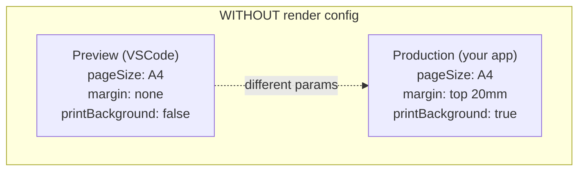
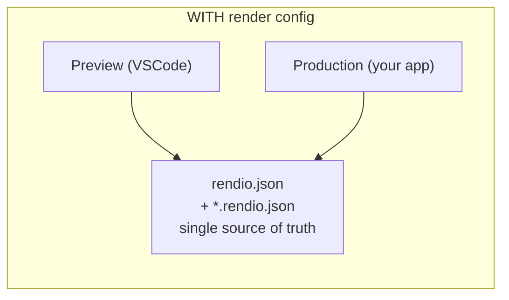

Every PDF service tells you "what you see in the preview is what you'll
get in production" and almost every one is lying. Preview runs with one
margin, production with another. Preview has `printBackground: true`,
production forgot. The page-size mismatch gets caught on the first real
customer invoice.

**Render Config** fixes this by moving your render options out of code
into JSON files that both the VSCode extension and your production app
read. You write the config once; the preview and your deployed render
share it byte-for-byte.

## The problem it fixes



**Result:** preview looks fine, production diverges.



**Result:** identical output, no drift.

## File layout

Two kinds of file, deep-merged in a defined order. Global defaults live
in one place; per-template overrides stay local.

```
your-repo/
├── rendio.json                ← project-wide defaults
└── templates/
    ├── invoice.hbs
    ├── invoice.data.json       ← mock data (for preview)
    └── invoice.rendio.json     ← per-template overrides
```

### Project-level — `rendio.json`

Sits at the workspace root. Applies to every template unless overridden.

```json
{
  "$schema": "https://rendio.dev/schemas/config/v1.json",
  "printBackground": true,
  "margin": { "top": "15mm", "bottom": "15mm", "left": "20mm", "right": "20mm" },
  "templates": {
    "templates/invoices/*.hbs": { "pageSize": "Letter" },
    "templates/labels/*.html":  { "width": "90mm", "height": "29mm" }
  }
}
```

The `templates` field is a glob map. Use single-`*` patterns — `**`
(recursive) is not supported. The first matching glob wins.

### Per-template — `*.rendio.json`

A sidecar file placed next to a template. Highest priority — overrides
both the project-level defaults and any glob match.

```json
{
  "$schema": "https://rendio.dev/schemas/config/v1.json",
  "landscape": true,
  "margin": { "top": "10mm", "bottom": "10mm" },
  "displayHeaderFooter": true,
  "footerTemplate": "<div style=\"font-size:9px;width:100%;text-align:center;\">Page <span class=\"pageNumber\"></span></div>"
}
```

Naming: `invoice.rendio.json` matches `invoice.hbs`, `invoice.html`, or
`invoice.tsx` — the match is on the base name, not the extension.

## Resolution order

Layers are deep-merged; later layers win:

1. `rendio.json` top-level fields.
2. `rendio.json` → `templates` glob — first match wins.
3. `<name>.rendio.json` sidecar next to the template.

Nested objects are deep-merged. Setting `margin.top` in a sidecar keeps
the rest of `margin` from the project level. Arrays replace (not merge).

<Tip>
  Add `"$schema": "https://rendio.dev/schemas/config/v1.json"` to both
  files. VS Code wires up JSON-Schema autocomplete — every field shows
  inline docs, and typos highlight as errors before you render.
</Tip>

## Supported fields

All 18 fields are accepted in any config file. `html`, `source`, `data`,
`response`, and `preview` are runtime parameters, not template config —
they can't go in `rendio.json`.

| Field | Type | Notes |
|---|---|---|
| `pageSize` | string | `"A4"`, `"A3"`, `"Letter"`, `"Legal"`, `"Tabloid"` |
| `landscape` | boolean | Rotates the page |
| `margin` | object | `{ top, bottom, left, right }` — CSS length strings (`"20mm"`, `"0.5in"`, `"72px"`) |
| `width` | string | Explicit page width, overrides `pageSize` |
| `height` | string | Explicit page height, overrides `pageSize` |
| `preferCSSPageSize` | boolean | Let `@page` CSS rules set the size |
| `scale` | number | `0.1` – `2.0`. Scales the page content. |
| `printBackground` | boolean | Include CSS backgrounds in output |
| `displayHeaderFooter` | boolean | Render `headerTemplate` / `footerTemplate` |
| `headerTemplate` | string | HTML string. Chromium special classes: `pageNumber`, `totalPages`, `date`, `title`, `url` |
| `footerTemplate` | string | Same as `headerTemplate` |
| `pageRanges` | string | e.g. `"1-5"`, `"1,3,5-8"`. Empty string = all pages. |
| `outline` | boolean | Generate a PDF outline (table of contents) |
| `waitUntil` | string | `"load"`, `"domcontentloaded"`, `"networkidle0"`, `"networkidle2"` |
| `delay` | number | Extra wait after `waitUntil` fires, in milliseconds |
| `waitForSelector` | string | CSS selector — Chromium waits until it appears before rendering |
| `output` | string | `"pdf"` (default), `"png"`, `"jpeg"` |
| `css` | string | Inline CSS or a file path (see below) |

### The `css` field

The `css` field accepts either inline CSS or a relative file path.
A value is treated as a file path if it ends with `.css` and contains no
`{` character.

```json
{ "css": "./shared/print.css" }
```

`@rendio/config` reads the referenced file and inlines its contents into
the resolved config object. The VSCode extension does the same for
previews — one stylesheet drives both.

### JSON Schema

```json
{ "$schema": "https://rendio.dev/schemas/config/v1.json" }
```

Add this to every config file. VS Code shows field descriptions,
validates values, and flags unknown keys inline.

## Full example

```json
// rendio.json — project defaults + glob overrides
{
  "$schema": "https://rendio.dev/schemas/config/v1.json",
  "printBackground": true,
  "pageSize": "A4",
  "margin": {
    "top": "20mm",
    "bottom": "20mm",
    "left": "20mm",
    "right": "20mm"
  },
  "templates": {
    "templates/labels/*.html": {
      "width": "90mm",
      "height": "29mm",
      "margin": { "top": "2mm", "bottom": "2mm" }
    }
  }
}
```

```json
// templates/invoice.rendio.json
{
  "$schema": "https://rendio.dev/schemas/config/v1.json",
  "displayHeaderFooter": true,
  "footerTemplate": "<div style=\"font-size:9px;text-align:right;\">Page <span class=\"pageNumber\"></span> / <span class=\"totalPages\"></span></div>",
  "css": "./invoice.print.css"
}
```

Resolved config for `templates/invoice.hbs`:
- `printBackground: true` (from project)
- `pageSize: "A4"` (from project)
- `margin: { top: "20mm", ... }` (from project — no sidecar override)
- `displayHeaderFooter: true` (from sidecar)
- `footerTemplate: "..."` (from sidecar)
- `css` inlined from `./invoice.print.css` (from sidecar)

## Using the same config in production

Install `@rendio/config` and call `resolveConfig()` before every render.
See [Using @rendio/config](/dev-prod-parity/using-rendio-config) for the
full API reference.

## Common pitfalls

**Skipping `@rendio/config`.** If you hand-write render options in your
production code and also maintain `rendio.json`, the two will drift.
The `resolveConfig()` call is the mechanism that closes the loop.

**Globs match relative to the workspace root.** `invoices/*.hbs` applies
to `<root>/invoices/*.hbs`. Use paths from the repo root, not from the
`templates/` directory.

**`@rendio/config` is Node-only.** Python and Go services can read
`rendio.json` directly as plain JSON. The resolution order is simple
enough to replicate in ~20 lines. See the tip in
[Using @rendio/config](/dev-prod-parity/using-rendio-config#for-non-node-languages).

## See also

- [Using @rendio/config](/dev-prod-parity/using-rendio-config) — `resolveConfig()` API, caching, validation.
- [POST /api/v1/render](/api-reference/render) — full parameter list and validation rules.
