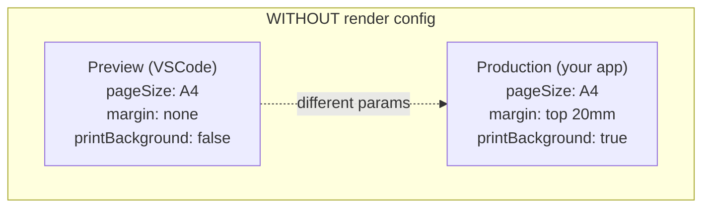
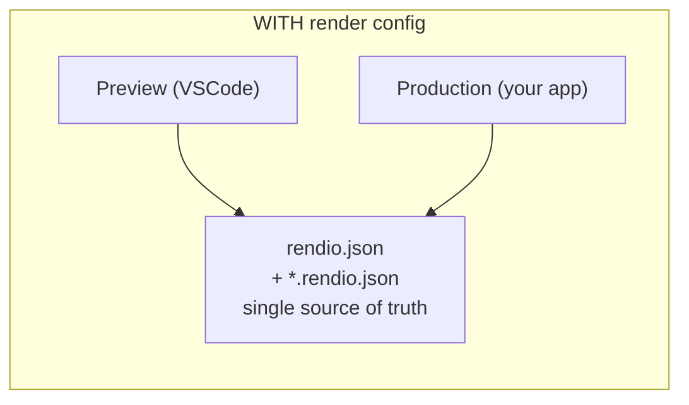

Every PDF service tells you "what you see in the preview is what you'll
get in production" and almost every one is lying. Preview runs with one
margin, production with another. Preview has `printBackground: true`,
production forgot. The page-size mismatch gets caught on the first real
customer invoice.

**Render Config** solves this by moving your render options out of code
into JSON files that **both** the VSCode extension and your production
app read. You write the config once; the preview and your deployed render
share it byte-for-byte.

## The problem it fixes



**Result:** preview looks fine, production diverges.



**Result:** identical output, no drift.

## File layout

Two kinds of file. **Deep-merged in a defined order** so global defaults
live in one place and per-template overrides stay local.

```
your-repo/
├── rendio.json                ← project-wide defaults
└── templates/
    ├── invoice.hbs
    ├── invoice.data.json       ← Handlebars mock data (for preview)
    └── invoice.rendio.json     ← per-template overrides
```

### Project-level — `rendio.json`

Sits at the workspace root. Applies to every template unless overridden.

```json
{
  "$schema": "https://rendio.dev/schemas/config/v1.json",
  "printBackground": true,
  "margin": { "top": "15mm", "bottom": "15mm", "left": "20mm", "right": "20mm" },
  "templates": {
    "templates/invoices/*.hbs":  { "pageSize": "Letter" },
    "templates/labels/*.html":   { "width": "90mm", "height": "29mm" }
  }
}
```

The `templates` glob map lets you set different defaults for whole
folders — labels at shipping-label size, invoices in Letter, everything
else falls through to the top level.

### Per-template — `*.rendio.json`

Sits next to a template file. Overrides everything else.

```json
{
  "$schema": "https://rendio.dev/schemas/config/v1.json",
  "landscape": true,
  "margin": { "top": "10mm", "bottom": "10mm" },
  "printBackground": true,
  "displayHeaderFooter": true,
  "footerTemplate": "<div style=\"font-size:9px;text-align:center;\">Page <span class=\"pageNumber\"></span></div>"
}
```

## Resolution order

Layers are deep-merged, later layers win:

1. `rendio.json` top-level fields.
2. `rendio.json` → `templates` glob match — first match wins.
3. `<name>.rendio.json` sidecar next to the template.

So `printBackground: true` in `rendio.json` stays true unless a sidecar
explicitly sets it to `false`. Nested objects like `margin` are deep-merged
— setting `margin.top` in a sidecar keeps the rest of `margin` from the
parent.

<Tip>
  The `$schema` pointer wires up native JSON-Schema autocomplete and
  validation in VSCode. Every field shows inline docs; typos highlight as
  errors. Saves writing wrong config in the first place.
</Tip>

## Using the same config in production

This is the whole point. Install `@rendio/config` in your app:

```bash
npm install @rendio/config
```

Then `resolveConfig()` walks the same layers the extension does and
returns a merged config object ready to spread into the SDK call:

```ts
import Rendio from "rendio";
import { resolveConfig } from "@rendio/config";
import { readFileSync } from "node:fs";

const rendio = new Rendio();

export async function renderInvoice(invoicePath: string, data: unknown): Promise<string> {
  const config = await resolveConfig(invoicePath);
  const html = readFileSync(invoicePath, "utf-8");

  const pdf = await rendio.pdfs.create({
    html,
    data,
    ...config,
  });

  return pdf.url;
}
```

Now the extension and your production render call are reading the same
`rendio.json` + `invoice.rendio.json` pair. When you tweak a margin
in VSCode and see the preview change, production changes with it on the
next deploy — no code edit required.

## Fields accepted in config files

Anything valid on `POST /api/v1/render` that isn't `html`, `source`, `data`,
`response`, or `preview` (those are runtime-level, not template-level):

```json
{
  "pageSize": "A4",
  "landscape": false,
  "margin": { "top": "20mm", "right": "20mm", "bottom": "20mm", "left": "20mm" },
  "width": "210mm",
  "height": "297mm",
  "scale": 1,
  "preferCSSPageSize": false,
  "printBackground": false,
  "displayHeaderFooter": false,
  "headerTemplate": "…",
  "footerTemplate": "…",
  "pageRanges": "1-",
  "tagged": false,
  "outline": false,
  "waitUntil": "domcontentloaded",
  "waitForSelector": ".ready",
  "delay": 0,
  "output": "pdf",
  "css": "./shared/print.css",
  "javascript": "…",
  "filename": "invoice.pdf"
}
```

### The `css` field

Special-cased: accepts either inline CSS or a **relative file path**.

```json
{ "css": "./shared/print.css" }
```

`@rendio/config` reads the referenced file and inlines its contents into
the resolved config. Same resolution in both the VSCode preview and your
production app — one stylesheet drives both.

## Typical workflow

<Steps>
  <Step title="Commit a rendio.json at the repo root">
    Set the defaults your project needs — typically `printBackground:
    true`, a page size, and your margins.
  </Step>
  <Step title="Add *.rendio.json sidecars for exceptions">
    Landscape labels, pre-signed legal pages, anything with unusual
    layout.
  </Step>
  <Step title="Preview locally in VSCode">
    Open the template, `Ctrl+Shift+R`. Adjust the sidecar file until the
    preview matches what you want.
  </Step>
  <Step title="Use @rendio/config in production">
    ```ts
    const config = await resolveConfig(templatePath);
    await rendio.pdfs.create({ html, data, ...config });
    ```
    Production renders match the preview.
  </Step>
</Steps>

## Common pitfalls

**Only the extension applies the config.** If you skip
`@rendio/config` and hand-write render options in your production code,
you're back to the drift problem the config files exist to solve. The
one-line `resolveConfig()` call is the mechanism.

**Sidecar file naming.** `invoice.rendio.json` applies to
`invoice.hbs`, `invoice.html`, or `invoice.tsx` — the extension matches
by base name, not extension. Keep `<template-name>.rendio.json` as
the pattern.

**Globs in `rendio.json` match paths relative to the workspace root.**
`invoices/*.hbs` applies to `<root>/invoices/*.hbs`, not arbitrary
subfolders. Use `**/*.hbs` for recursive match.

**`@rendio/config` is Node-only.** Go and Python services can read
`rendio.json` files directly as JSON and merge the options into their
render calls — the config format is plain JSON with no Node-specific
logic. The resolution order (project defaults → glob match → sidecar)
is simple enough to replicate in ~20 lines.

## See also

- [VSCode overview](/dev-prod-parity/live-preview) — extension install and features.
- [POST /api/v1/render](/api-reference/render) — the full parameter list you can put in config files.
